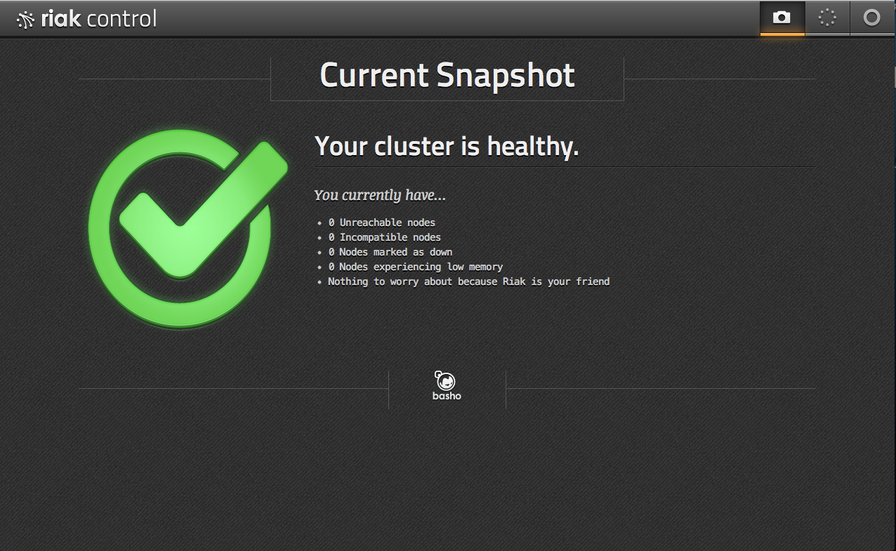

Riak Control (管理コンソール)
==============================

Riakの管理コンソールをセットアップしてみます。

Riak Controlの有効化
--------------------

dev1ノードのriak_controlを有効化します。

Riak Controlを使用する為に、ssl設定とriak_controlそのものを有効化します。

変更前後のdiff

::

  % diff -u dev/dev1/etc/app.config.back dev/dev1/etc/app.config

  --- dev/dev1/etc/app.config.back        2013-02-20 00:10:21.000000000 +0900
  +++ dev/dev1/etc/app.config     2013-03-16 01:15:10.000000000 +0900
  @@ -34,14 +34,14 @@

                 %% https is a list of IP addresses and TCP ports that the Riak
                 %% HTTPS interface will bind.
  -              %{https, [{ "127.0.0.1", 10018 }]},
  +              {https, [{ "127.0.0.1", 11018 }]},

                 %% Default cert and key locations for https can be overridden
                 %% with the ssl config variable, for example:
  -              %{ssl, [
  -              %       {certfile, "./etc/cert.pem"},
  -              %       {keyfile, "./etc/key.pem"}
  -              %      ]},
  +              {ssl, [
  +                     {certfile, "./etc/cert.pem"},
  +                     {keyfile, "./etc/key.pem"}
  +                    ]},

                 %% riak_handoff_port is the TCP port that Riak uses for
                 %% intra-cluster data handoff.
  @@ -307,7 +307,7 @@
    %% riak_control config
    {riak_control, [
                   %% Set to false to disable the admin panel.
  -                {enabled, false},
  +                {enabled, true},

                   %% Authentication style used for access to the admin
                   %% panel. Valid styles are 'userlist' <TODO>.

編集が済んだらriakをリスタートします。

::

  % dev/dev1/bin/riak restart

下記のURLにアクセスして認証すると管理画面が表示されます。

- https://localhost:11018/admin
- id:   user
- pass: pass

ノードのleave
-------------

Cluster Management(https://localhost:11018/admin#/cluster)の画面で任意のノードの「Action -> Leave」をClickします。

該当ノードが持っていたデータの転送が終わると、leaveしたノードは停止します。

ノードのjoin
------------

停止したノードを再度クラスタへ追加します。

*riak start* でノードを起動し、 Join Nodesのフォームにノード名(例：dev1@127.0.1)を入力して「Add nodes」をClickします。

